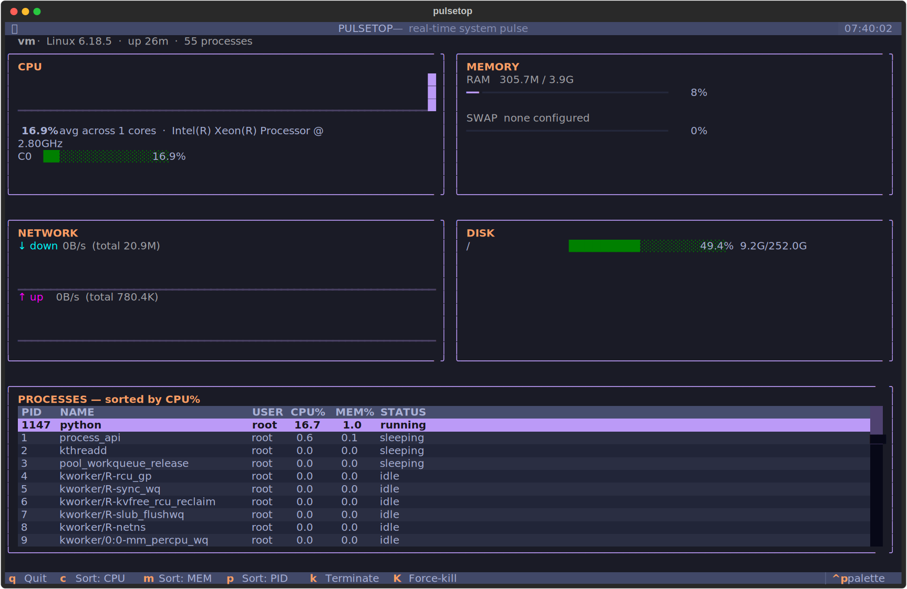
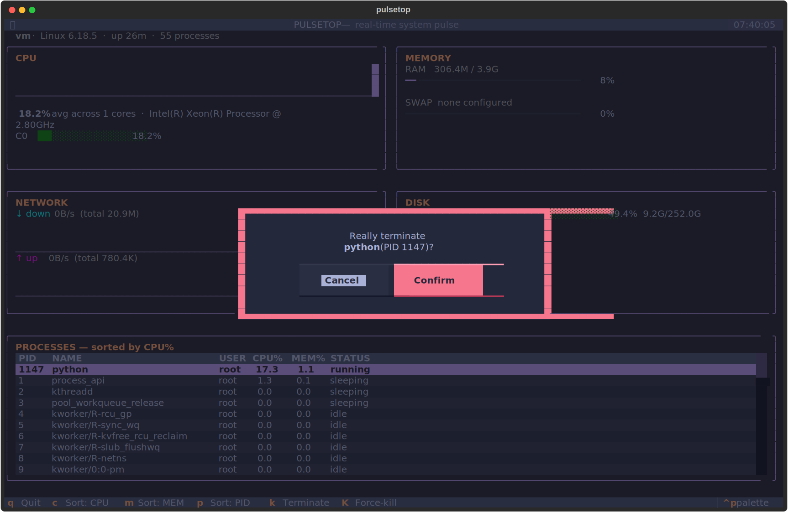

# pulsetop

**A fast, good-looking terminal system monitor.** CPU, memory, network, disk
and processes — live, in one dashboard, with zero config.

[](LICENSE)
[](https://www.python.org/)
[](https://github.com/Textualize/textual)
[](https://github.com/o-mdonyelwa/pulsetop/actions/workflows/ci.yml)



> The screenshot above is a real, pixel-accurate capture of the running app
> (not a mockup) — see [Regenerating the screenshots](#regenerating-the-screenshots).

## Why

Most system monitors are either ugly (`top`), heavy (a full GUI), or written
in a language that makes them painful to hack on. `pulsetop` is built on
[Textual](https://github.com/Textualize/textual), so it's a single
`pip install` away, looks genuinely good in any terminal, and the whole
codebase is readable Python you can extend in an afternoon.

## Features

- **Live CPU** — rolling history sparkline plus a per-core usage graph
- **Memory & swap** — clean progress bars with exact figures
- **Network** — separate up/down throughput sparklines and totals
- **Disk** — usage bars per mount point (noisy pseudo-filesystems filtered out)
- **Process table** — sortable by CPU%, MEM%, or PID, with `terminate` /
  `force-kill` actions and a confirmation prompt so you can't fat-finger your
  shell into oblivion
- **20 built-in themes** — Tokyo Night, Dracula, Nord, Gruvbox, Catppuccin and
  more, switchable live from the command palette (`ctrl+p`)
- **No root, no daemons, no config files** — just run it

## Install

`pulsetop` isn't on PyPI yet — install straight from the repo:

```bash
git clone https://github.com/o-mdonyelwa/pulsetop.git
cd pulsetop
pip install .
pulsetop
```

Or for local development (editable install):

```bash
pip install -e ".[dev]"
```

Requires Python 3.9+. Works on Linux and macOS; Windows works under WSL.

## Usage

```bash
pulsetop
```

| Key       | Action                              |
| --------- | ------------------------------------ |
| `q`       | Quit                                 |
| `c`       | Sort processes by CPU%               |
| `m`       | Sort processes by MEM%                |
| `p`       | Sort processes by PID                |
| `k`       | Terminate the selected process       |
| `K`       | Force-kill (`SIGKILL`) the selected process |
| `↑` / `↓` | Move the process selection           |
| `ctrl+p`  | Open the command palette (theme switcher, etc.) |

Every destructive action (`k` / `K`) asks for confirmation first.



## Theming

`pulsetop` ships with Textual's full set of built-in themes. Open the command
palette with `ctrl+p`, search "theme", and pick one — it applies instantly,
no restart needed.

## Project layout

```
src/pulsetop/
├── app.py              # PulseTopApp — layout, bindings, refresh loop
├── system.py           # SystemMonitor — all psutil polling lives here
└── widgets/
    ├── cpu_panel.py
    ├── mem_panel.py
    ├── net_panel.py
    ├── disk_panel.py
    ├── proc_panel.py
    ├── info_bar.py
    └── confirm_kill.py # kill/terminate confirmation modal
scripts/screenshot.py   # regenerates assets/*.svg from a live run
tests/test_smoke.py     # headless Textual tests + SystemMonitor unit tests
```

`system.py` has no Textual imports — metrics collection is fully decoupled
from the UI, so it's easy to test or reuse on its own.

## Development

```bash
pip install -e ".[dev]"
pytest         # headless UI tests + system-monitor unit tests
ruff check .   # lint
```

### Regenerating the screenshots

The images in this README are real captures, generated with Textual's
built-in SVG export running against the actual app:

```bash
python scripts/screenshot.py
```

This writes fresh files into `assets/`. Worth re-running on a machine with
more than one CPU core for a more dramatic CPU panel.

## Roadmap

- [ ] Per-process tree view (parent/child relationships)
- [ ] GPU usage panel (NVIDIA via `pynvml`, fallback elsewhere)
- [ ] Process filtering / search
- [ ] Config file for default theme, refresh rate, and panel layout
- [ ] `pipx install pulsetop` once published to PyPI

Contributions toward any of the above are very welcome — see below.

## Contributing

Issues and PRs are welcome. For anything non-trivial, please open an issue
first to discuss the approach. Run `pytest` and `ruff check .` before
submitting.

## License

MIT — see [LICENSE](LICENSE).

## Acknowledgements

Built with [Textual](https://github.com/Textualize/textual) and
[psutil](https://github.com/giampaolo/psutil).
